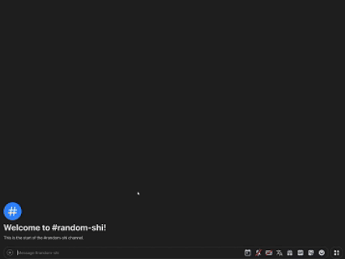

# SS2IMGUR

A simple Python script that automatically uploads screenshots to Imgur and copies the link to the clipboard. This tool runs in the background and monitors a specified folder for new screenshots, with an option to save the links to a text file.



## Features

- Automatically uploads new screenshots to Imgur.
- Copies the image link to your clipboard for easy sharing.
- Optionally saves each screenshot link in a text file (`screenshot_links.txt`).
- Lightweight and runs in the background.

## Requirements

- Python 3.x
- Required packages:
  - `requests`
  - `pyperclip`
  - `watchdog`
  - `python-dotenv`

## Installation

1. Clone the repository:
   ```bash
   git clone https://github.com/KryAboutIt/ss2imgur.git
   cd ss2imgur
   ```

2. Install the required packages:
   ```bash
   pip install -r requirements.txt
   ```

3. Acquire your Imgur Client ID:
   - Go to [Imgur's API registration page](https://api.imgur.com/oauth2/addclient).
   - Fill out the application form:
     - **Application name**: Choose a name for your application (e.g., "Cool Screenshot Uploader").
     - **Authorization type**: Select "OAuth 2 authorization without a callback URL".
     - **Authorization callback URL**: You shouldn't see this option if you chose "OAuth 2 authorization without a callback URL".
     - **Email**: Enter your email address.
     - **Description**: You can put anything you want.
   - Submit the form and note your **Client ID**.

4. Create a `.env` file in the project directory and add your Imgur Client ID:
   ```plaintext
   IMGUR_CLIENT_ID=your_client_id_here
   ```

5. **Optional**: To enable or disable saving links, modify the `SAVE_LINKS` variable in the script: 
```python
SAVE_LINKS = True # Change to False to disable saving links 
```

## Usage

1. Run the script:
   ```bash
   python main.py
   ```

2. The program will now run in the background, uploading any new screenshots you take. Note that while the command prompt will remain open, you can minimize it to keep your workspace clear.

## Running at Startup

To have your script run automatically every time you boot up your PC, follow these steps:

1. **Open Task Scheduler**:
   - Press `Windows + R`, type `taskschd.msc`, and hit `Enter`.

2. **Create a New Task**:
   - In the right pane, click on **Create Basic Task...**.

3. **Name and Describe Your Task**:
   - Give your task a name (e.g., "ss2imgur") and a description, then click **Next**.

4. **Trigger**:
   - Choose **When I log on** and click **Next**.

5. **Action**:
   - Select **Start a program** and click **Next**.

6. **Program/Script**:
   - Click **Browse** and navigate to the location of your Python executable (usually `C:\Users\<YourUsername>\AppData\Local\Programs\Python\Python3xx\python.exe`).
   - In the **Add arguments (optional)** field, type the path to your script (e.g., `C:\path\to\your\script.py`).

7. **Finish**:
   - Click **Next**, review your settings, and then click **Finish**.

### Optional: Create a Batch File

To run the script with the command prompt visible (but able to be minimized), you can create a batch file:

1. **Create a Batch File**:
   - Open a text editor and type:
     ```bat
     @echo off
     start python C:\path\to\your\script.py
     ```
   - Save it with a `.bat` extension (e.g., `ss2imgur_launcher.bat`).

2. **Use the Batch File in Task Scheduler**:
   - Instead of pointing to `python.exe`, point to your batch file.

## Contributing

Feel free to open issues or submit pull requests if you'd like to contribute to the project.

## License

This project is licensed under the MIT License - see the [LICENSE](LICENSE) file for details.

## Author

[KryAboutIt](https://github.com/KryAboutIt)
